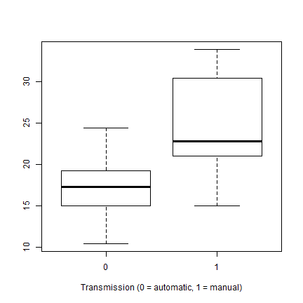
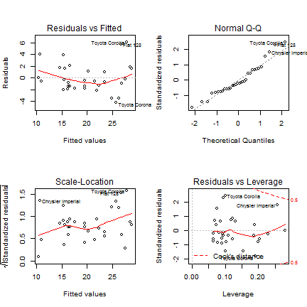

## Summary
- Questions
  - Is an automatic or manual transmission better for miles per gallon (MPG)?
  - How different is the MPG between automatic and manual transmissions?
- Conclusion
  - Cars with a manual transmission have a slightly better than automatic for MPG.
  - This different is statistical INSIGNIFICANT.

---&twocol
## Exploratory Data
*** =left
- Data
  - mtcars is a data frame with 32 observations on 11 variables.
  - For regression, variables vs and am should be category.

```r
mtcars$vs <- as.factor(mtcars$vs)
mtcars$am <- as.factor(mtcars$am)
```

- Relationship between mpg and am
	- mpg (Miles/(US) gallon) vs. am (Transmission).
  - Boxplot it.
  - There's a good separation of groups based on gas mileage.

*** =right


 


---&twocol
## Building the Model
*** =left
- Analysis of variance
	- There are 10 predictor variables in the data set.
	- Some may play bigger role to determination of mpg.
	- Using aov to fit an analysis of variance model.

```
##             Df Sum Sq Mean Sq F value Pr(>F)    
## cyl          1    818     818  116.42  5e-10 ***
## disp         1     38      38    5.35 0.0309 *  
## hp           1      9       9    1.33 0.2610    
## drat         1     16      16    2.34 0.1406    
## wt           1     77      77   11.03 0.0032 ** 
## qsec         1      4       4    0.56 0.4617    
## vs           1      0       0    0.02 0.8932    
## am           1     14      14    2.06 0.1659    
## gear         1      1       1    0.14 0.7137    
## carb         1      0       0    0.06 0.8122    
## Residuals   21    147       7                   
## ---
## Signif. codes:  0 '***' 0.001 '**' 0.01 '*' 0.05 '.' 0.1 ' ' 1
```


*** =right
- Fit the model
	- Variables with p-value below 0.05 are more important.
	- Variables cyl, disp, wt, drat and am are selected.
	- After fit the first two models, drat ans disp are droped. 

```r
lm <- lm(mpg ~ cyl + wt + am, data = mtcars)
summary(lm)
```

```
## 
## Call:
## lm(formula = mpg ~ cyl + wt + am, data = mtcars)
## 
## Residuals:
##    Min     1Q Median     3Q    Max 
## -4.173 -1.534 -0.539  1.586  6.081 
## 
## Coefficients:
##             Estimate Std. Error t value Pr(>|t|)    
## (Intercept)   39.418      2.641   14.92  7.4e-15 ***
## cyl           -1.510      0.422   -3.58   0.0013 ** 
## wt            -3.125      0.911   -3.43   0.0019 ** 
## am1            0.176      1.304    0.14   0.8933    
## ---
## Signif. codes:  0 '***' 0.001 '**' 0.01 '*' 0.05 '.' 0.1 ' ' 1
## 
## Residual standard error: 2.61 on 28 degrees of freedom
## Multiple R-squared:  0.83,	Adjusted R-squared:  0.812 
## F-statistic: 45.7 on 3 and 28 DF,  p-value: 6.51e-11
```


---&twocol
## Diagnostic the model
*** =left
- Result
	- The adjusted r-squared is 0.83
	- Compare with cylinders and weight, the ceofficient of the am variable is small (0.176).
	- p-value of am is 0.8933
	- We cannot reject the hypothesis that the coefficient of am is 0.
	- No discernible pattern found in diagnostic graph.
	
*** =right
- Diagnostic
 

